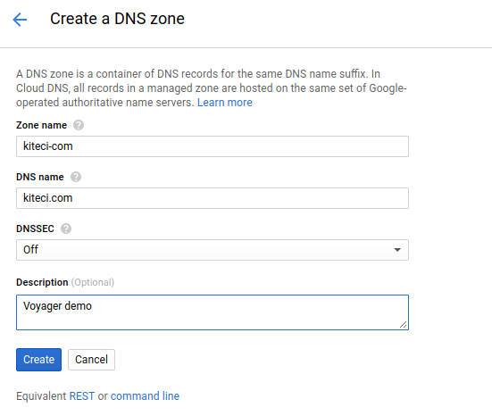
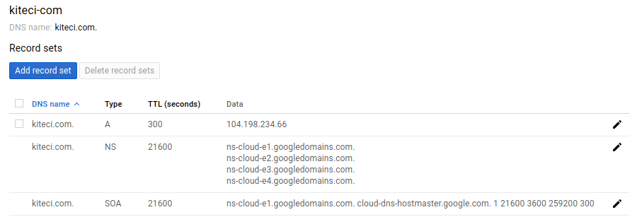
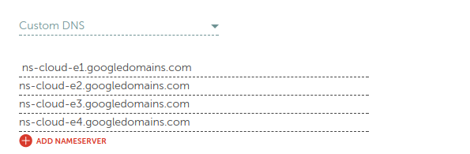
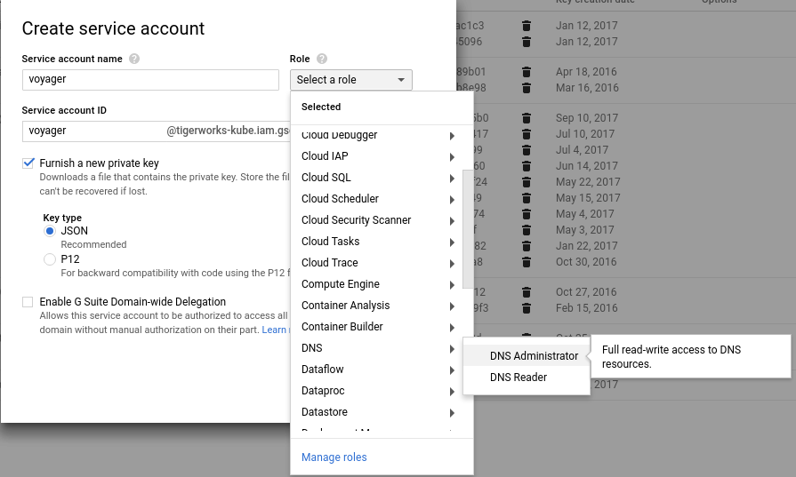

# Issue Let's Encrypt certificate using Google Cloud DNS

This tutorial shows how to issue free SSL certificate from Let's Encrypt via DNS challenge for domains using Google Cloud DNS service.

This article has been tested with a GKE cluster.

```console
$ kubectl version --short
Client Version: v1.8.3
Server Version: v1.8.4-gke.0
```

## Deploy Voyager operator

Deploy Voyager operator following instructions here: https://github.com/appscode/voyager/blob/master/docs/install.md

```console
# install without RBAC
curl -fsSL https://raw.githubusercontent.com/appscode/voyager/5.0.0-rc.5/hack/deploy/voyager.sh \
  | bash -s -- gke
```

If you are trying this on a RBAC enabled cluster, pass the flag `--rbac` to installer script.

```console
# install without RBAC
curl -fsSL https://raw.githubusercontent.com/appscode/voyager/5.0.0-rc.5/hack/deploy/voyager.sh \
  | bash -s -- gke --rbac
```

## Setup Google Cloud DNS Zone

In this tutorial, I am going to use `kiteci.com` domain that was purchased on namecheap.com . Now, go to the [DNS page](https://console.cloud.google.com/net-services/dns/zones) on your Google Cloud console and create a zone for this domain.



Once the zone is created, you can see the list of name servers in Google cloud console.



Now, go to the website of your domain registrar and update the list of name servers.



Give time to propagate the updated DNS records. You can use the following command to confirm that the name server records has been updated.

```console
$ dig -t ns kiteci.com

; <<>> DiG 9.10.3-P4-Ubuntu <<>> -t ns kiteci.com
;; global options: +cmd
;; Got answer:
;; ->>HEADER<<- opcode: QUERY, status: NOERROR, id: 60415
;; flags: qr rd ra; QUERY: 1, ANSWER: 4, AUTHORITY: 0, ADDITIONAL: 9

;; OPT PSEUDOSECTION:
; EDNS: version: 0, flags:; udp: 512
;; QUESTION SECTION:
;kiteci.com.			IN	NS

;; ANSWER SECTION:
kiteci.com.		21600	IN	NS	ns-cloud-e3.googledomains.com.
kiteci.com.		21600	IN	NS	ns-cloud-e4.googledomains.com.
kiteci.com.		21600	IN	NS	ns-cloud-e1.googledomains.com.
kiteci.com.		21600	IN	NS	ns-cloud-e2.googledomains.com.

;; ADDITIONAL SECTION:
ns-cloud-e1.googledomains.com. 143957 IN A	216.239.32.110
ns-cloud-e1.googledomains.com. 144007 IN AAAA	2001:4860:4802:32::6e
ns-cloud-e2.googledomains.com. 143976 IN A	216.239.34.110
ns-cloud-e2.googledomains.com. 144137 IN AAAA	2001:4860:4802:34::6e
ns-cloud-e3.googledomains.com. 144001 IN A	216.239.36.110
ns-cloud-e3.googledomains.com. 144532 IN AAAA	2001:4860:4802:36::6e
ns-cloud-e4.googledomains.com. 144141 IN A	216.239.38.110
ns-cloud-e4.googledomains.com. 144080 IN AAAA	2001:4860:4802:38::6e

;; Query time: 55 msec
;; SERVER: 127.0.1.1#53(127.0.1.1)
;; WHEN: Mon Dec 04 09:15:19 PST 2017
;; MSG SIZE  rcvd: 333
```

## Configure Service Account Permissions

To issue SSL certificate using Let's Encrypt, we have to prove that we own the `kiteci.com` domain. Voyager operator requires necessary permission to add and remove a TXT record for domain `_acme-challenge.<domain>` to complete the DNS challenge. Here we will create a new ServiceAccount called `voyager` in [Service Accounts console](https://console.cloud.google.com/iam-admin/serviceaccounts/project) and grant it `DNS Administrator` permission. Then we wil issue an access key pair for this IAM role and pass this to voyager using a Kubernetes secret.



```console
mv <your_service_account_key>.json GOOGLE_SERVICE_ACCOUNT_JSON_KEY

kubectl create secret generic voyager-gce --namespace default \
  --from-literal=GCE_PROJECT=INSERT_YOUR_PROJECT_ID_HERE \
  --from-file=GOOGLE_SERVICE_ACCOUNT_JSON_KEY

$ kubectl get secret voyager-gce -o yaml
apiVersion: v1
data:
  GCE_PROJECT: dGlnZXJ3b3Jrcy1rdWJl
  GOOGLE_SERVICE_ACCOUNT_JSON_KEY: ewogICJ0eXBlIj2VhY2NvdW50LmNvbSIKfQo=
kind: Secret
metadata:
  creationTimestamp: 2017-12-04T17:36:24Z
  name: voyager-gce
  namespace: default
  resourceVersion: "7372"
  selfLink: /api/v1/namespaces/default/secrets/voyager-gce
  uid: a612c439-d919-11e7-81d9-42010a8000db
type: Opaque
```

**NB**:

- The Kubernetes secret must be created in the same namespace where the `Certificate` object exists.

